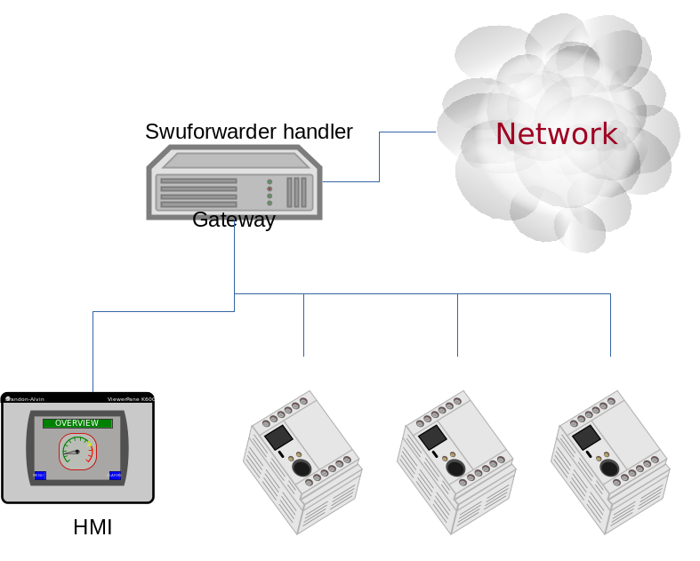

=============================================
处理程序
=============================================

概览
--------

很难预见所有可能的安装情况。
SWUpdate不尝试找出并支持所有用例，
而是让开发人员能自由添加自己的安装程序(即新的 **处理程序** )，
它必须负责安装某种类型的镜像。
镜像被标记为一种已定义的类型，将使用特定的处理程序安装。

解析器在 '镜像类型' 和 '处理程序' 之间建立连接。
它维护一个表用于执行安装，其中包含要安装的镜像列表和处理程序。
每个镜像可以有不同的安装程序。

已提供的处理程序
-----------------

主线代码中有用于最常见情况的处理程序。它们包括:
	- 裸数据模式的flash设备(NOR 和 NAND)
	- UBI卷
	- 裸设备，例如一个SD卡分区
	- 启动引导程序 (U-Boot, GRUB, EFI Boot Guard) 的环境变量
	- Lua脚本

例如，如果将图像标记为要更新到UBI卷，解析器必须在维护的表中设置 "ubi"
为需要的处理程序，并填充此处理程序所需的其他字段：卷名、大小等等。

创建自己的处理程序
---------------------

SWUpdate可以使用新的处理程序进行扩展。
用户需要向核心注册自己的处理程序，并且必须提供SWUpdate在需要使用新处理程序
安装镜像时使用的回调。

回调的原型是:

::

	int my_handler(struct img_type *img,
		void __attribute__ ((__unused__)) *data)

最重要的参数是指向struct img_type的指针。
它描述单个镜像并通知处理程序镜像必须安装在何处。
输入流的文件描述符会设置为安装镜像的开始，这也是结构的一部分。

结构 *img_type* 包含指向要安装的镜像的第一个字节的流的文件描述符。
处理程序必须读取整个镜像，当它返回时，
SWUpdate可以继续处理流中的下一个镜像。

SWUpdate提供了一个通用函数来从流中提取数据并复制到其他地方:

::

        int copyfile(int fdin, int fdout, int nbytes, unsigned long *offs,
                int skip_file, int compressed, uint32_t *checksum, unsigned char *hash);

fdin是输入流，即来自回调的img->fdin。对于签名镜像，只需将 *hash* 传递
给copyfile()来执行检查，就像 *checksum* 参数一样。如果校验和或散列不匹配，
copyfile()将返回一个错误。处理程序不需要为它们费心。

处理程序如何管理复制的数据，是特定于处理程序本身的。
请参阅提供的处理程序代码以更好地进行理解。

处理程序的开发人员使用以下调用方式注册自己的处理程序：

::

	__attribute__((constructor))
	void my_handler_init(void)
	{
		register_handler("mytype", my_handler, my_mask, data);
	}

SWUpdate使用gcc构造函数，并且在初始化SWUpdate时注册所有提供的处理程序。

register_handler的语法如下:

::

	register_handler(my_image_type, my_handler, my_mask, data);

其中:

- my_image_type : 标识自己的新镜像类型的字符串。
- my_handler :指向要注册的安装程序的指针。
- my_mask : ``HANDLER_MASK`` 枚举值，指定 my_handler 可处理什么输入类型。
- data : 一个可选的指向自定义结构的指针。SWUpdate会将其保存在处理程序
  的列表中，并在执行时传递给处理程序。

UBI卷处理程序
-----------------------

UBI卷的处理程序被认为可以在不改变存储布局的情况下更新UBI卷。
卷必须提前设置:处理程序本身不创建卷。它在所有MTD中搜索一个卷
(如果它们没有被列入黑名单:请参阅 UBIBLACKLIST)，以找到要安装映像的卷。
因此，卷在系统内必须是惟一的。
不支持名称相同的两个卷，这会导致不可预知的结果。
SWUpdate将安装镜像到名称匹配的第一个卷，这可能不是期望的行为。

更新卷时，可以保证擦除计数器在更新后不会丢失。
更新的方式与来自mtd-utils的 "ubiupdatevol" 相同。
事实上上，SWUpdate重用了来自mtd-utils (libubi)的同一个库。

SWUpdate通常创建动态卷。如果需要静态卷，请将处理程序的数据字段
设置为 "static"。

如果存储为空，则需要设置布局并创建卷。这可以通过预安装脚本轻松完成。
使用meta-SWUpdate进行构建时，原始的mtd-utils是可用的，
并且可以由Lua脚本调用。

Lua 处理程序
------------

除了用C编写处理程序之外，还可以使用在Lua编写，并在SWUpdate启动时加载。
Lua处理程序源代码文件可以通过 ``CONFIG_EMBEDDED_LUA_HANDLER`` 配置选
项嵌入到SWUpdate二进制文件中，也可以作为 ``swupdate_handlers.lua``
安装到目标系统的Lua搜索路径中，这样它就可以在运行时由嵌入的lua解释器加载。

与C处理程序类似，Lua处理程序的原型是

::

        function lua_handler(image)
            ...
        end

其中 ``image`` 是一个 Lua 表 (包含了
:ref:`sw-description's attribute reference <sw-description-attribute-reference>`)
相关的属性），描述了处理程序要处理的单个工件。

请注意，属性名称中的破折号会被Lua域的下划线所替换，以使其符合惯例，
例如， ``installed_direct`` 在Lua域中会变为 ``installed_directy`` 。

要注册Lua处理程序， ``swupdate`` 模块提供了 ``swupdate.register_handler()``
方法，该方法接受处理程序的名称、要以该名称注册的Lua处理程序函数，
以及(可选地)可以调用处理程序的工件类型。
如果没有提供后者，则Lua处理程序将为所有类型的工件注册。
以下调用将上述函数 ``lua_handler`` 注册为 *my_handler* ，
该函数可以用于镜像:

::

        swupdate.register_handler("my_handler", lua_handler, swupdate.HANDLER_MASK.IMAGE_HANDLER)

Lua处理程序可以通过 ``swupdate.call_handler()`` 方法调用C处理程序("链式")。
在表 ``swupdate.handler`` 中包含已注册的可被调用的C处理程序(作为键)。
下面的Lua代码是一个简单的处理程序链的例子——调用 ``rawfile`` C处理程序:

::

        function lua_handler(image)
            if not swupdate.handler["rawfile"] then
                swupdate.error("rawfile handler not available")
                return 1
            end
            image.path = "/tmp/destination.path"
            local err, msg = swupdate.call_handler("rawfile", image)
            if err ~= 0 then
                swupdate.error(string.format("Error chaining handlers: %s", msg))
                return 1
            end
            return 0
        end

注意，当链式调用C处理程序，用于并非Lua处理程序本身所注册的类型的工件时，
``image`` 表的值必须满足被调用的C处理程序的期望：考虑上面的Lua处理程序
，通过上述的 ``swupdate.register_handler()`` 注册为用于"images"
(``swupdate.HANDLER_MASK.IMAGE_HANDLER``)。根据
:ref:`sw-description's attribute reference <sw-description-attribute-reference>`,
"images"工件类型没有 ``path`` 属性，但是"file"工件类型有。
所以，为了调用 ``rawfile`` 处理程序， ``image.path`` 必须在链式
调用 ``rawfile`` 处理程序之前被设置好，如上例所示。
然而，通常情况下，如果Lua处理程序注册为支持处理 ``image`` 的同一工件类型，
则不需要进行此类调整。

除了调用C处理程序之外，作为参数传递给Lua处理程序的 ``image`` 表还有一个
``image:copy2file()`` 方法，该方法实现了将输入流的数据写入文件的常见用例，
该文件作为该方法的参数传递。如果成功， ``image:copy2file()``  将返回 ``0`` ,
在失败时则将返回 ``-1`` 并附带一条错误消息。
下面的Lua代码是一个简单的处理程序调用 ``image:copy2file()`` 的例子:

::

        function lua_handler(image)
            local err, msg = image:copy2file("/tmp/destination.path")
            if err ~= 0 then
                swupdate.error(string.format("Error calling copy2file: %s", msg))
                return 1
            end
            return 0
        end

除了使用 ``image:copy2file()`` 或链式调用C处理程序外，
作为参数传递给Lua处理程序的 ``image`` 表还有一个
``image:read(<callback()>)`` 方法，该方法从输入流中读取数据，
并对每个读取的块调用Lua回调方法 ``<callback()>`` , 读取的块
会被作为参数传递进去。成功时， ``image:read()`` 返回 ``0`` 。
失败时，返回 ``-1`` 并附带一条错误信息。
下面的Lua代码是一个简单的处理程序打印工件内容的例子:

::

        function lua_handler(image)
            err, msg = image:read(function(data) print(data) end)
            if err ~= 0 then
                swupdate.error(string.format("Error reading image: %s", msg))
                return 1
            end
            return 0
        end

使用 ``image:read()`` 方法，工件的内容可以在Lua中(后)处理并利用
Lua的功能，而不需要依赖于预先存在的C处理程序来达到预期的目的。

正如C处理程序一样，Lua处理程序必须使用其 ``image`` 参数中描述的工件，
以便SWUpdate可以在Lua处理程序返回后继续处理流中的下一个工件。
链式处理程序可调用 ``image:copy2file()`` 或使用 ``image:read()``
以满足这个要求。

请注意，尽管Lua处理程序的动态特性在技术上允许将它们嵌入在
将要处理的 ``swu`` 镜像中，但实际上并未被实现的，因为SWUpdate
的行为是动态更改的，这么做会带来一些安全问题，

远程处理程序
--------------

远程处理程序是用于绑定到传统安装程序，而不需要在Lua中重写它们。
远程处理程序将要安装的镜像转发到另一个进程，等待确认镜像是否正确安装。
远程处理程序使用zeromq库——这是为了简化基于Unix域套接字的IPC机制的使用。
远程处理程序非常通用，在sw-description中用 "data" 属性描述
如何与外部进程通信。
远程处理程序始终充当客户机，并尝试使用由 "data" 属性标识的套接字进行连接。
例如，使用远程处理程序的可能设置是:

::

        images: (
                {
                    filename = "myimage"";
                    type = "remote";
                    data = "test_remote";
                 }
        )

连接使用套接字 "/tmp/test_remote" 进行实例化。
如果connect()失败，远程处理程序将发出更新不成功的信号。
来自SWUpdate的每个Zeromq消息都是一个分为两帧的多部分消息:

        - 第一帧包含一个带命令的字符串。
        - 第二帧包含数据，可以是0字节。

目前只有两个可能的命令:INIT和DATA。
成功连接后，SWUpdate以以下格式发送初始化字符串:

::

        INIT:<size of image to be installed>

外部安装程序被告知要安装的映像的大小，如果需要，它可以分配资源。
它将用字符串 *ACK* 或 *NACK* 来回答。SWUpdate接收到的第一个NACK将中断更新。
发送INIT命令后，远程处理程序将发送一系列 *DATA* 命令，
其中消息中的第二帧将包含要安装的镜像数据块。
外部进程要责任处理这一系列传输的数据，并在接收完最后一个块时释放资源。
对于每个数据消息，外部进程使用 *ACK* 或 *NACK* 消息进行响应。

SWU 转发
---------------

SWU转发器处理程序可用于更新正在运行SWUpdate的其他系统。
它可以用于主/从系统，其中主机连接到网络，而从机则对外界隐藏。
因此，主机是与外部世界的唯一接口。
通常一个SWU镜像可以将另一个SWU镜像作为单个工件进行包含，
SWU处理程序将它转发到工件描述中列出的设备。
处理程序可以有一个带有url数组的 "url" 属性条目。
每个url是一个辅助板的地址，其中运行着激活了webserver的SWUpdate。
SWU处理程序期望与SWUpdate的嵌入式web服务器通信。
这有助于更新正在运行旧版本SWUpdate的系统，
因为嵌入式web服务器是所有版本中都存在的公共特性。
处理程序将同时将嵌入的SWU发送到所有url，该处理程序支持设置
``installed_direct`` 。

下面的例子展示了如何将SWU设置为工件并启用SWU转发器:

::

	images: (
		{
			filename = "image.swu";
			type = "swuforward";

			properties: {
				url = ["http://192.168.178.41:8080", "http://192.168.178.42:8080"];
			};
		});

ucfw 处理程序
-------------

此处理程序允许通过UART更新连接到主控制器的单片机上的固件。
用于设置的参数将通过sw-description文件传递。
它的行为可以扩展到更一般的情况。
协议是基于ASCII的。在处理程序发送数据并等待来自单片机的ACK之后，
需要完成一个将单片机置于编程模式的序列。

对固件的编程动作应该如下:

1. 进入固件更新模式(引导加载程序)
        1. 将 "复位线" 设置为逻辑 "低"
        2. 将 "更新线" 设置为逻辑 "低"
        3. 将 "复位线" 设置为逻辑 "高"

2. 发送编程信息

::

        $PROG;<<CS>><CR><LF>

到单片机。(单片机会保持在编程状态)

3. 单片机使用以下方式发出确认

::

        $READY;<<CS>><CR><LF>

4.从主板发送数据传输包到单片机

包定义:

        - 在一个包中，记录是一个接一个地发送，没有结束行标记 <CR><LF>
        - 包以 <CR><CF> 作为结束

5. 单片机以$READY;<<CS>><CR><LF>请求下一个包

6. 重复步骤4和步骤5，直到传输完整个固件。

7. 键盘使用 $COMPLETED;<<CS>><CR><LF> 确认更新完成

8. 退出升级模式
        1. 设置 "更新线" 为逻辑 "高"
        2. 在 "复位线" 上执行复位

<<CS>>:校验和。校验和的计算，是对除开始标记 "$" 之外的消息字符串的所有字节
做和运算，再对256取模，再做补码得到。
处理程序期望从属性中获得用于初始化的复位线和编程线的gpio口。
它们应该是这样的格式:

::

        properties = {
	        reset = "<gpiodevice>:<gpionumber>:<activelow>";
                prog = "<gpiodevice>:<gpionumber>:<activelow>";
        }

例子:

::

        properties = {
                reset =  "/dev/gpiochip0:38:false";
                prog =  "/dev/gpiochip0:39:false";
        }

