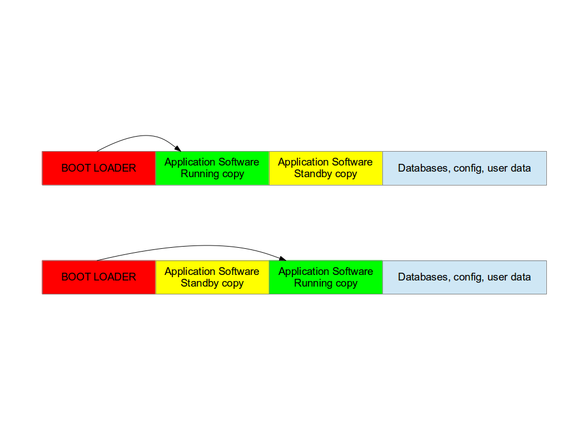
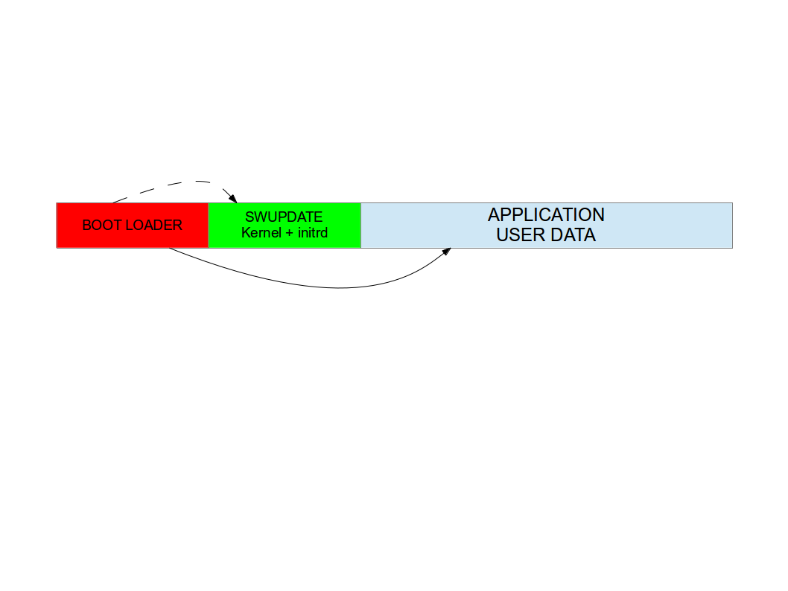
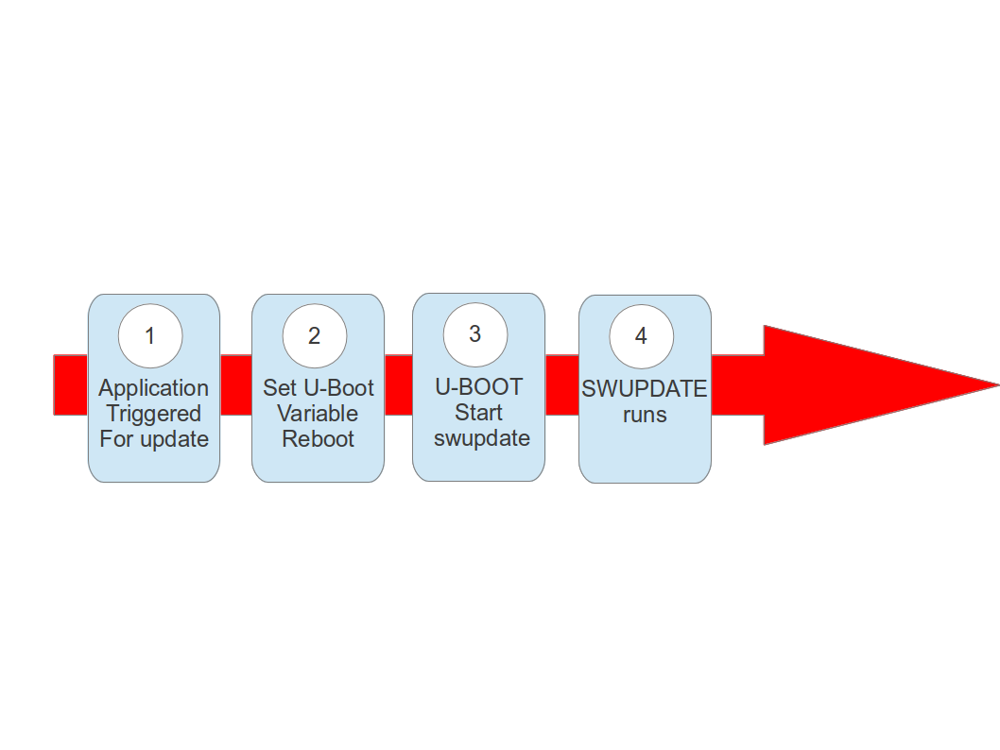
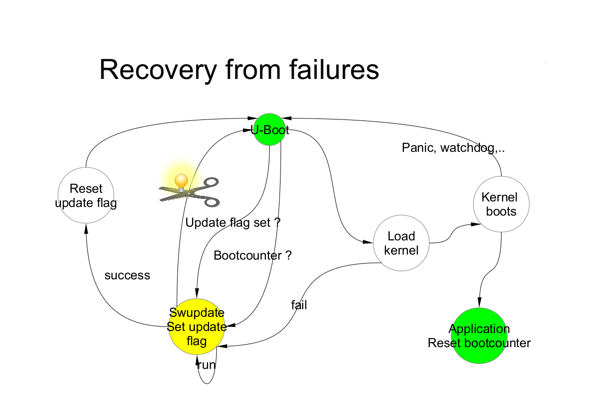

=======================================
嵌入式系统的软件管理
=======================================
嵌入式系统变得越来越复杂，
它们的软件也反映了这种复杂性的增加。
为了支持新的特性和修复，很有必要让嵌入式系统上的软件
能够以绝对可靠的方式更新。
在基于linux的系统上，我们可以在大多数情况下找到
以下元素:

- 引导装载程序
- 内核和设备树
- 根文件系统
- 其他在后续挂载的文件系统，other file systems, mounted at a later point
- 用户资料，以裸数据格式存在或者保存在文件系统中
- 特定用途的软件. 如，用于下载到相连接的微控制器的固件等

一般来说，在大多数情况下是需要更新
内核和根文件系统，保存用户数据-但实际情况各不相同。

仅在少数情况下，还需要更新引导加载程序，
事实上，更新引导加载程序总是很危险的，
因为更新中的失败会破坏设备。
在某些情况下，从损坏状态中恢复是可能的，
但这通常无法由最终用户完成，即设备需要返厂维修。

关于软件更新有很多不同的概念。
我将解释其中的一些概念，
然后解释为什么我实施了这个项目。

通过引导加载程序完成更新
================================

引导加载程序所做的工作远不止启动内核那么简单。
它们有自己的shell，且可以使用处理器的外围设备
进行管理，在大多数情况下是通过串行通讯。
它们通常是可执行脚本的，这使得
实现某种软件更新机制成为了可能。

然而，我发现这种方法有一些缺点，
这让我另行寻找基于运行在Linux上的应用程序的解决方案。

引导加载程序对外围设备的使用有局限性
-----------------------------------------------

并不是所有内核中支持的设备都可以在引导加载程序使用。
向内核添加设备支持是有意义的，因为这可以让外围设备对主应用程序可用，
但将驱动程序移植到引导加载程序中，就并不总是有意义的了。

引导加载程序的驱动程序不会被更新
-------------------------------------

引导加载程序的驱动程序大多是从Linux内核移植过来的，
但是由于经过调整的原因，它们以后不会被修复或与内核同步，
而bug修复则会定期在Linux内核中进行。

一些外围设备可能以不可靠的方式工作，
并且修复问题可能并不容易。引导加载程序中的驱动程序
或多或少是内核中相应驱动程序的复刻(fork)。

例如，用于NAND设备的UBI/UBIFS在内核中包含
了许多修复程序，这些修复程序并没有移植回引导加载程序。

USB协议栈也可以找到相同的情况。支持新外围设备或协议的工作,
在内核中进行得更好，而不是在引导加载程序中。

简化版的文件系统
--------------------

支持的文件系统的数量是有限的。
将文件系统支持移植到引导加载程序需要付出很大的努力。

网络支持有限
--------------------------

网络协议栈是有限的，通常通过一个更新只能通过
UDP但不能通过TCP完成。

与操作人员交互
-----------------------------

很难将接口暴露给操作员，
比如浏览器中的GUI或显示器上的GUI。

比起在引导加载程序中，复杂的逻辑可以在应用程序内部更容易实现。
扩展引导加载程序是复杂的，因为所有的服务和库都不可用。

引导加载程序更新的优点
-------------------------------
然而，这种方法也有一些优点：

-更新软件通常更简单。
-占用空间更小：即使是一个仅用于软件管理的独立应用程序
也需要自己的内核和根文件系统。即使它们的大小能够被裁剪，
将更新软件不需要的部分去掉，它们的大小也是不可忽略的。

通过包管理器更新
==================================

所有的Linux发行版都使用包管理器做更新，
为什么这不适用于嵌入式系统？

我不能说它不能被使用，但是使用这种方法有一个重要的缺点。
嵌入式系统是使用特定的软件进行过良好测试的。
使用包管理器可能会让人觉得奇怪，因为软件本身不再是 *原子的* ，
而是分裂成一系列包。
我们怎样才能保证一个能基于库版本x.y正常工作的应用程序，
同样也能基于同一个库的不同版本工作呢?如何才能成功地做好测试?

对于制造商来说，通常更好的说法是发布了一个新的软件版本
(经过测试工程师的良好测试)，并且可以更新新的软件(或固件)。
对测试人员来说，在包中进行拆分可能会产生噩梦和巨大的工作量。

简单地替换单个文件可以加快开发速度，
但是对于客户站点来说，这是一个软件版本的噩梦。
如果客户报告了一个bug，那么在之前已经向客户发送过
一些文件的补丁时，软件怎么可能还算是“2.5版本”呢?

原子更新通常是嵌入式系统的必备特性。

应用程序进行软件升级的策略
====================================================

应用程序也可以用于升级系统，而不是使用引导加载程序。
应用程序可以使用操作系统提供的所有服务。
建议的解决方案是一个独立的软件，
它遵循客户规则，执行检查以确定软件是否可安装，
然后将软件安装到所需的存储上。

应用程序可以检测所提供的新软件是否适合硬件，
也可以检查软件是否由经过验证的权威机构发布。
支持的特性范围可以从小型系统扩展到复杂系统，
包括安装前和安装后脚本等等。

根据系统的资源，可以使用不同的策略。
下面我将列出其中一些。

双备份系统 - 支持回退
--------------------------

如果存储空间足够保存整个软件的两个副本，
那么即使软件更新被中断或断电，也可以保证始终有一个可用的副本。

每个副本必须包含内核、根文件系统和每个可以更新的组件。
需要一种机制来识别正在运行的版本。

SWUpdate应该集成到应用程序软件中，
当需要更新时，应用程序软件将触发它。
SWUpdate的职责是更新备用副本，
不修改正在运行的软件副本。

与引导加载程序的协作通常是必要的，
因为引导加载程序必须决定应该启动哪个副本。
同样，必须能够在两个副本之间进行切换。

重新启动后，引导加载程序决定应该运行哪个副本。

请参阅有关引导加载程序的章节，
了解可以实现哪些机制来确保更新后目标不会被破坏。

最明显的缺点是所需的空间量。
每个副本的可用空间小于存储空间的一半。
然而，即使在断电的情况下，更新也总是安全的。

这个项目支持这个策略。
作为该项目一部分的应用程序应该安装在根文件系统中，
并根据需要启动或触发。不需要额外的内核，
因为这两个副本保证总是可以升级不运行的副本。

SWUpdate将设置bootloader变量以通知新映像已成功安装。

单系统 - 以独立镜像形式运行
-----------------------------------------

软件升级应用程序由内核（可裁剪掉不必要的驱动等）
和一个小的根文件系统以及应用程序及其库组成。
整个大小远远小于系统软件的一个副本。
根据设置，这个独立根文件系统的大小从 2.5MB 到 8MB 不等。
如果说大小对于小型系统非常重要，
那么对于具有大量存储或大容量NAND的系统，
其大小则可以忽略不计。

系统可以进入“升级”模式，只需向引导加载程序发出必须启动升级软件的信号。
具体方法可能有所不同，例如设置引导加载程序环境或使用和外部GPIO。

引导加载程序启动“SWUpdate”，
引导SWUpdate内核并将initrd映像作为根文件系统。
因为它在RAM中运行，所以可以升级整个存储。
与双拷贝策略不同，系统必须重新启动以将其自身置于更新模式。

这个方案比起使用两个副本，占用的存储空间更少，
但是它不能保证在不再次更新软件的情况下进行回退。
不过，至少它可以保证，当主应用不存在或损坏时，
以及当升级过程由于某种原因而中断时，系统自动进入升级模式。

事实上，可以将升级过程视为事务，
只有成功升级后，新软件才设置为“可引导”。
考虑到这些因素，使用此策略进行升级是安全的:
如果旧软件损坏或无法运行，
始终确保系统启动并准备好获得新软件。

使用U-Boot作为引导加载程序，
SWUpdate能够管理U-Boot的环境设置变量，
以指示事务的开始和结束，以及包含有效的软件的存储区域。
针对GRUB环境块修改和EFI引导保护的类似特性也已被引入。

SWUpdate主要以如下配置的方式使用。
Yocto生成包含SWUpdate应用程序的initrd映像，
该映像在挂载根文件系统之后自动启动。

有些事情出错了 ?
======================

许多事情都可能出错，必须保证系统能够再次运行，
并且可能能够重新加载新的软件来修复损坏的映像。
SWUpdate与引导加载程序一起工作，以识别失败的可能原因。
目前支持U-Boot、GRUB和EFI引导保护。

我们至少可以列出一些常见的原因:

-安装过程中镜像损坏。
 SWUpdate能够识别它，并且更新过程会被中止。
 旧的软件被保存下来，没有任何东西被真正复制到目标的存储中

- 存储(flash)中损坏的镜像

- 远程更新由于通信问题而中断

- 意外掉电

SWUpdate的工作流程是事务性的。引导加载程序的环境变量“recovery_status”
被设置为向引导加载程序发出更新状态的信号。
当然，还可以添加更多变量，用于微调和报告错误原因。
recovery_status可以取值为“progress”，“failed”，或者它也可以被取消设置。

当SWUpdate启动时，它将recovery_status设置为“progress”。
更新成功完成后，变量将被删除。如果更新以错误结束，
recovery_status的值为“failed”。

当更新被中断时，不管什么原因，引导加载程序都能识别到，
因为recovery_status变量处于“progress”或“failed”状态。
然后，引导加载程序可以再次启动SWUpdate，以再次
加载软件(单副本情况)或运行应用程序的旧副本(双副本情况)。

Power Failure
-------------

If a power off occurs, it must be guaranteed that the system is able
to work again - starting again SWUpdate or restoring an old copy of the software.

Generally, the behavior can be split according to the chosen scenario:

- single copy: SWUpdate is interrupted and the update transaction did not end
  with a success. The boot loader is able to start SWUpdate again, having the
  possibility to update the software again.

- double copy: SWUpdate did not switch between stand-by and current copy.
  The same version of software, that was not touched by the update, is
  started again.

To be completely safe, SWUpdate and the bootloader need to exchange some
information. The bootloader must detect if an update was interrupted due
to a power-off, and restart SWUpdate until an update is successful.
SWUpdate supports the U-Boot, GRUB, and EFI Boot Guard bootloaders.
U-Boot and EFI Boot Guard have a power-safe environment which SWUpdate is
able to read and change in order to communicate with them. In case of GRUB,
a fixed 1024-byte environment block file is used instead. SWUpdate sets
a variable as flag when it starts to update the system and resets the same
variable after completion. The bootloader can read this flag to check if an
update was running before a power-off.

What about upgrading SWUpdate itself ?
--------------------------------------

SWUpdate is thought to be used in the whole development process, replacing
customized process to update the software during the development. Before going
into production, SWUpdate is well tested for a project.

If SWUpdate itself should be updated, the update cannot be safe if there is only
one copy of SWUpdate in the storage. Safe update can be guaranteed only if
SWUpdate is duplicated.

There are some ways to circumvent this issue if SWUpdate is part of the
upgraded image:

- have two copies of SWUpdate
- take the risk, but have a rescue procedure using the boot loader.

What about upgrading the Boot loader ?
--------------------------------------

Updating the boot loader is in most cases a one-way process. On most SOCs,
there is no possibility to have multiple copies of the boot loader, and when
boot loader is broken, the board does not simply boot.

Some SOCs allow to have multiple copies of the
boot loader. But again, there is no general solution for this because it
is *very* hardware specific.

In my experience, most targets do not allow to update the boot loader. It
is very uncommon that the boot loader must be updated when the product
is ready for production.

It is different if the U-Boot environment must be updated, that is a
common practice. U-Boot provides a double copy of the whole environment,
and updating the environment from SWUpdate is power-off safe. Other boot loaders
can or cannot have this feature.
