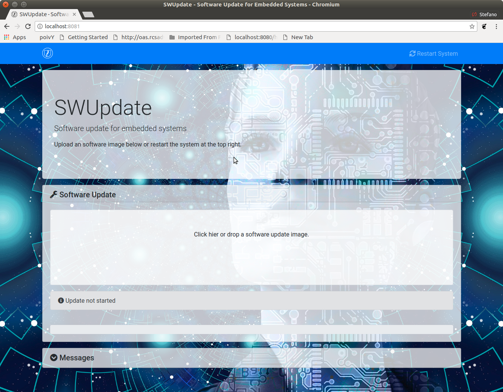
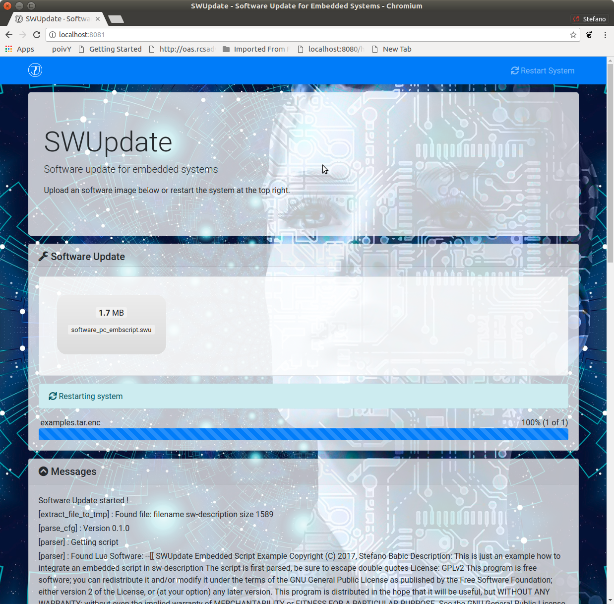

=============================================
SWUpdate: 嵌入式系统的软件升级
=============================================

概述
========

本项目被认为有助于从存储媒体或网络更新嵌入式系统。
但是，它应该主要作为一个框架来考虑，在这个框架中可以方便地
向应用程序添加更多的协议或安装程序(在SWUpdate中称为处理程序)。

一个用例是从外部本地媒体(如USB-Pen或sd卡)进行更新。
在这种情况下，更新是在没有操作员干预的情况下完成的:
它被认为是“一键更新”，软件在复位时启动，只需按下一个键
(或者以任何目标可以识别的方式)，自动进行所有检查。
最后，更新过程只向操作员报告状态(成功或失败)。

输出可以使用帧缓冲设备显示在LCD上，
也可以定向到串行通讯端口上(Linux控制台)。

它通常用于单拷贝方案中，在initrd中运行(用Yocto提供的配方生成)。
但是，通过使用软件集合( :ref:`collections` )，可以在双拷贝方案中使用它。

如果启动了远程更新，SWUpdate将启动嵌入式web服务器并等待请求。
操作者必须上传一个合适的映像，然后SWUpdate会进行检查并安装。
所有输出都通过AJAX通知的方式通知操作人员的浏览器。

功能
========

总体概览
----------------

- 安装在嵌入式介质上(eMMC、SD、Raw NAND、NOR、SPI-NOR flash)

- 检查镜像是否可用。镜像以指定的格式(cpio)构建，它必须包含一个描述文件，
  以描述必须更新的软件。

- SWUpdate被认为可以更新设备上的UBI卷(主要用于NAND，
  但不限于NAND)和镜像。传递整个镜像仍然用于对SD卡上
  的分区或MTD分区进行更新。

- 新分区模式。这与UBI容量有关。SWUpdate可以重新创建UBI卷，
  调整它们的大小并复制新软件。一个名为“data”的特殊UBI卷
  在重新分区时，用于保存和恢复数据，以保持好用户数据。

- 使用zlib库支持压缩镜像。支持tarball (tgz文件)。

- 支持带分区的USB-pen或未分区盘(主要用于Windows)。

- 支持更新文件系统中的单个文件。
  必须明确描述该文件所在的文件系统位置。

- 支持图像中单个组件的校验和

- 使用结构化语言来描述镜像。
  这是使用 libconfig_ 库作为缺省解析器完成的，它使用一种类似json的描述。

- 使用自定义的方式来描述镜像。可以使用Lua语言编写自己的解析器。
  examples目录中提供了一个使用Lua中的XML描述的示例。

- 支持设置/删除U-Boot变量

- 支持设置/擦除 `GRUB`_ 环境块变量

- 支持设置/删除 `EFI Boot Guard`_ 变量

- 使用嵌入式web服务器的网络安装程序
  (在Lua许可下的版本中选择了Mongoose服务器)。
  可以使用不同的web服务器。

- 多种获取软件的接口
       - 本地存储: USB, SD, UART,..

- OTA / 远程
       - 集成的网络服务器
       - 从远程服务器拉取(HTTP, HTTPS， ..)
       - 使用后端。SWUpdate是开放的，可以与后端服务器进行通信，
         以推出软件更新。当前版本支持Hawkbit服务器，
         但可以添加其他后端。

- 可以配置为检查软件和硬件之间的兼容性。
  软件映像必须包含条目，声明这个软件可在什么版本硬件上运行。
  如果没有通过兼容性验证，SWUpdate将拒绝安装。

- 支持镜像提取。制造商用一个映像包含用于多个设备的软件。
  这简化了制造商的管理，并降低了单一软件产品的管理成本。
  SWUpdate以流的形式接收软件，不进行临时存储，并只提取需要安装的设备组件。

- 允许自定义处理器，通过自定义协议安装FPGA固件，微控制器固件。

- 使用“make menuconfig”启用/禁用特性。(Kbuild继承自busybox项目)

- 镜像在安装之前经过身份认证和校验

- 掉电安全

.. _libconfig: http://www.hyperrealm.com/libconfig/
.. _GRUB: https://www.gnu.org/software/grub/manual/html_node/Environment-block.html
.. _EFI Boot Guard: https://github.com/siemens/efibootguard

Single image delivery
---------------------

The main concept is that the manufacturer delivers a single
big image. All single images are packed together (cpio was chosen
for its simplicity and because can be streamed) together with
an additional file (sw-description), that contains meta
information about each single image.

The format of sw-description can be customized: SWUpdate can be
configured to use its internal parser (based on libconfig), or calling
an external parser in Lua.

.. image:: images/image_format.png

Changing the rules to accept images with an external parser,
let to extend to new image types and how they are installed.
In fact, the scope of the parser is to retrieve which single
images must be installed and how.
SWUpdate implements "handlers" to install a single image:
there are handlers to install images into UBI volumes,
or to a SD card, a CFI Flash, and so on. It is then easy to
add an own handler if a very special installer is required.

For example we can think at a project with a main processor and
one or several micro-controllers. Let's say for simplicity that
the main processor communicates with the micro-controllers via
UARTS using a proprietary protocol. The software on the micro-controllers
can be updated using the proprietary protocol.

It is possible to extend SWUpdate writing a handler, that implements
the part of the proprietary protocol to perform the upgrade
on the micro-controller. The parser must recognize which image must be
installed with the new handler, and SWUpdate will call the handler
during the installation process.

Streaming feature
-----------------

SWUpdate is thought to be able to stream the received image directly into
the target, without any temporary copy. In fact, the single installer
(handler) receive as input the file descriptor set at the beginning of
the image that must be installed.

The feature can be set on image basis, that means that a user can
decide which partial images should be streamed. If not streamed (see
installed-directly flag), files are temporary extracted into the directory
pointed to by the environment variable ``TMPDIR`` with ``/tmp`` as
fall-back if ``TMPDIR`` is not set.
Of course, by streaming it is not possible to make checks on the whole delivered
software before installing.
The temporary copy is done only when updated from network. When the image
is stored on an external storage, there is no need of that copy.

Images fully streamed
---------------------

In case of remote update, SWUpdate extracts relevant images from the stream
and copies them into the directory pointed to by the environment variable 
``TMPDIR`` (if unset, to ``/tmp``) before calling the handlers.
This guarantee that an update is initiated only if all parts are present and
correct. However, on some systems with less resources, the amount of RAM
to copy the images could be not enough, for example if the filesystem on
an attached SD Card must be updated. In this case, it will help if the images
are installed directly as stream by the corresponding handler, without temporary
copies. Not all handlers support to stream directly into the target.
Streaming with zero-copy is enabled by setting the flag "installed-directly"
in the description of the single image.

Configuration and build
=======================

Requirements
------------

There are only a few libraries that are required to compile SWUpdate.

- mtd-utils: internally, mtd-utils generates libmtd and libubi.
  They are commonly not exported and not installed, but they are
  linked by SWUpdate to reuse the same functions for upgrading
  MTD and UBI volumes.
- openssl: required with the Webserver
- Lua: liblua and the development headers.
- libz, libcrypto are always linked.
- libconfig: it is used by the default parser.
- libarchive (optional) for archive handler
- libjson (optional) for JSON parser and Hawkbit
- libubootenv (optional) if support for U-Boot is enabled
- libebgenv (optional) if support for EFI Boot Guard is enabled
- libcurl used to communicate with network

New handlers can add some other libraries to the requirement list -
check if you need all handlers in case you get build errors,
and drop what you do not need.

Building with Yocto
-------------------

A meta-swupdate_ layer is provided. It contains the required changes
for mtd-utils and for generating Lua. Using meta-SWUpdate is a
straightforward process.

Firstly, clone meta-SWUpdate.

::

        git clone https://github.com/sbabic/meta-swupdate.git

.. _meta-SWUpdate:  https://github.com/sbabic/meta-swupdate.git

Add meta-SWUpdate as usual to your bblayers.conf. You have also
to add meta-oe to the list.

In meta-SWUpdate there is a recipe to generate an initrd with a
rescue system with SWUpdate. Use:

::

	MACHINE=<your machine> bitbake swupdate-image

You will find the result in your tmp/deploy/<your machine> directory.
How to install and start an initrd is very target specific - please
check in the documentation of your bootloader.

What about libubootenv ?
------------------------

This is a common issue when SWUpdate is built. SWUpdate depends on this library,
that is generated from the U-Boot's sources. This library allows to safe modify
the U-Boot environment. It is not required if U-Boot is not used as bootloader.
If SWUpdate cannot be linked, you are using an old version of U-Boot (you need
at least 2016.05). If this is the case, you can add your own recipe for
the package u-boot-fw-utils, adding the code for the library.

It is important that the package u-boot-fw-utils is built with the same
sources of the bootloader and for the same machine. In fact, the target
can have a default environment linked together with U-Boot's code,
and it is not (yet) stored into a storage. SWUpdate should be aware of
it, because it cannot read it: the default environment must be linked
as well to SWUpdate's code. This is done inside the libubootenv.

If you build for a different machine, SWUpdate will destroy the
environment when it tries to change it the first time. In fact,
a wrong default environment is taken, and your board won't boot again.

Configuring SWUpdate
--------------------

SWUpdate is configurable via "make menuconfig". The small footprint
is reached using the internal parser and disabling the web server.
Any option has a small help describing its usage. In the default
configuration, many options are already activated.

To configure the options:

::

	make menuconfig

Building
--------

- to cross-compile, set the CC and CXX variables before running make.
  It is also possible to set the cross-compiler prefix as option with
  make menuconfig.
- generate the code

::

	make

The result is the binary "swupdate". A second binary "progress" is built,
but it is not strictly required. It is an example how to build your
own interface to SWUpdate to show a progress bar or whatever you want on your
HMI. The example simply prints on the console the current status of the update.

In the Yocto buildsystem,:

::

        bitbake swupdate

This will build the package

::

        bitbake swupdate-image

This builds a rescue image. The result is a Ramdisk that
can be loaded directly by the bootloader.
To use SWUpdate in the double-copy mode, put the package
swupdate into your rootfs. Check your image recipe, and
simply add it to the list of the installed packages.

For example, if we want to add it to the standard "core-image-full-cmdline"
image, we can add a *recipes-extended/images/core-image-full-cmdline.bbappend*

::

        IMAGE_INSTALL += " \
                                swupdate \
                                swupdate-www \
                         "

swupdate-www is the package with the website, that you can customize with
your own logo, template ans style.

Building a debian package
-------------------------

SWUpdate is thought for Embedded Systems and building in an embedded
distribution is the first use case. But apart the most used buildsystems
for embedded as Yocto or Buildroot, in some cases a standard Linux distro
is used. Not only, a distro package allows to run SWUpdate on Linux PC
for test purposes without having to fight with dependencies. Using the
debhelper tools, it is possible to generate a debian package.

Steps for building a debian package
...................................

::

        ./debian/rules clean
        ./debian/rules build
        fakeroot debian/rules binary

The result is a "deb" package stored in the parent directory.

Alternative way signing source package
......................................

You can use dpkg-buildpackage:

::

        dpkg-buildpackage -us -uc
        debsign -k <keyId>

Running SWUpdate
================

What is expected from a SWUpdate run
------------------------------------

A run of SWUpdate consists mainly of the following steps:

- check for media (USB-pen)
- check for an image file. The extension must be .swu
- extracts sw-description from the image and verifies it
  It parses sw-description creating a raw description in RAM
  about the activities that must be performed.
- Reads the cpio archive and proofs the checksum of each single file
  SWUpdate stops if the archive is not complete verified
- check for hardware-software compatibility, if any,
  reading hardware revision from hardware and matching
  with the table in sw-description.
- check that all components described in sw-description are
  really in the cpio archive.
- modify partitions, if required. This consists in a resize
  of UBI volumes, not a resize of MTD partition.
  A volume with the name "data" is saved and restored after
  resizing.
- runs pre-install scripts
- iterates through all images and call the corresponding
  handler for installing on target.
- runs post-install scripts
- update bootloader environment, if changes are specified
  in sw-description.
- reports the status to the operator (stdout)

The first step that fails, stops the entire procedure and
an error is reported.

To start SWUpdate expecting the image from a file:

::

	        swupdate -i <filename>

To start with the embedded web server:

::

	         swupdate -w "<web server options>"

The main important parameters for the web server are "document-root" and "port".

::

	         swupdate -w "--document-root ./www --port 8080"

The embedded web server is taken from the Mongoose project.

The whole list of options will be retrieved with:

::

        swupdate -h

This uses as website the pages delivered with the code. Of course,
they can be customized and replaced. The website uses AJAX to communicate
with SWUpdate, and to show the progress of the update to the operator.

The default port of the Web-server is 8080. You can then connect to the target
with:

::

	http://<target_ip>:8080

If it works, the start page should be displayed as in next figure.

If a correct image is downloaded, SWUpdate starts to process the received image.
All notifications are sent back to the browser. SWUpdate provides a mechanism
to send to a receiver the progress of the installation. In fact, SWUpdate
takes a list of objects that registers itself with the application
and they will be informed any time the application calls the notify() function.
This allows also for self-written handlers to inform the upper layers about
error conditions or simply return the status. It is then simply to add
own receivers to implement customized way to display the results: displaying
on a LCD (if the target has one), or sending back to another device via
network.
An example of the notifications sent back to the browser is in the next figure:

Software collections can be specified by passing `--select` command
line option. Assuming `sw-description` file contains a collection
named `stable`, with `alt` installation location, `SWUpdate` can be
called like this::

   swupdate --select stable,alt

Command line parameters
-----------------------

+-------------+----------+--------------------------------------------+
|  Parameter  | Type     | Description                                |
+=============+==========+============================================+
| -f <file>   | string   | SWUpdate config file to use                |
+-------------+----------+--------------------------------------------+
| -b <string> | string   | Active only if CONFIG_UBIATTACH is set     |
|             |          | It allows to blacklist MTDs when SWUpdate  |
|             |          | searches for UBI volumes.                  |
|             |          | Example: U-Boot and environment in MTD0-1: |
|             |          | **swupdate -b "0 1"**                      |
+-------------+----------+--------------------------------------------+
| -e <sel>    | string   | sel is in the format <software>,<mode>     |
|             |          | It allows to find a subset of rules in     |
|             |          | the sw-description file. With it,          |
|             |          | multiple rules are allowed.                |
|             |          | One common usage is in case of the dual    |
|             |          | copy approach. Example:                    |
|             |          | -e "stable, copy1"  ==> install on copy1   |
|             |          | -e "stable, copy2"  ==> install on copy2   |
+-------------+----------+--------------------------------------------+
| -h          |    -     | run usage with help                        |
+-------------+----------+--------------------------------------------+
| -k          | string   | Active if CONFIG_SIGNED is set             |
|             |          | Filename with the public key               |
+-------------+----------+--------------------------------------------+
| -l <level>  |    int   | Set loglevel                               |
+-------------+----------+--------------------------------------------+
| -L          |    -     | Send LOG output to syslog(local)           |
+-------------+----------+--------------------------------------------+
| -i <file>   | string   | run SWUpdate with a local .swu file        |
+-------------+----------+--------------------------------------------+
| -n          |    -     | run SWUpdate in dry-run mode.              |
+-------------+----------+--------------------------------------------+
| -N          | string   | passed the current installed version of    |
|             |          | software. This will be checked with the    |
|             |          | version of new software and forbids        |
|             |          | downgrading.                               |
|             |          | Version mconsists of 4 number:             |
|             |          | major.minor.rev.build                      |
|             |          | each field is in the range 0..65535        |
+-------------+----------+--------------------------------------------+
| -o <file>   | string   | saves the stream (SWU) on a file           |
+-------------+----------+--------------------------------------------+
| -v          |    -     | activate verbose output                    |
+-------------+----------+--------------------------------------------+
| -w <parms>  | string   | start internal webserver and pass to it    |
|             |          | a command line string.                     |
+-------------+----------+--------------------------------------------+
| -u <parms>  | string   | start internal suricatta client daemon and |
|             |          | pass to it a command line string.          |
|             |          | see suricatta's documentation for details. |
+-------------+----------+--------------------------------------------+
| -H          | string   | set board name and Hardware revision       |
| <board:rev> |          |                                            |
+-------------+----------+--------------------------------------------+
| -c          |    -     | This will check ``*.swu`` file against     |
|             |          | internal tests. It ensures that files      |
|             |          | referenced in sw-description are present.  |
|             |          | Usage: swupdate -c -i <file>               |
+-------------+----------+--------------------------------------------+
| -p          | string   | Execute post-update command.               |
+-------------+----------+--------------------------------------------+
+-------------+----------+--------------------------------------------+
| -d <parms>  | string   | Active only if CONFIG_DOWNLOAD is set      |
|             |          | start internal downloader client and pass  |
|             |          | to it a command line string.               |
|             |          | See below the internal command line        |
|             |          | arguments for the downloader               |
+-------------+----------+--------------------------------------------+
| -u <url>    | string   | This is the URL where new software is      |
|             |          | pulled. URL is a link to a valid .swu image|
+-------------+----------+--------------------------------------------+
| -r <retries>| integer  | Number of retries before a download is     |
|             |          | considered broken. With "-r 0", SWUpdate   |
|             |          | will not stop until a valid software is    |
|             |          | loaded.                                    |
+-------------+----------+--------------------------------------------+
| -t <timeout>| integer  | Timeout for connection lost when           |
|             |          | downloading                                |
+-------------+----------+--------------------------------------------+
| -a <usr:pwd>| string   | Send user and password for Basic Auth      |
+-------------+----------+--------------------------------------------+

systemd Integration
-------------------

SWUpdate has optional systemd_ support via the compile-time
configuration switch ``CONFIG_SYSTEMD``. If enabled, SWUpdate
signals systemd about start-up completion and can make optional
use of systemd's socket-based activation feature.

A sample systemd service unit file ``/etc/systemd/system/swupdate.service``
may look like the following starting SWUpdate in suricatta daemon mode:

::

	[Unit]
	Description=SWUpdate daemon
	Documentation=https://github.com/sbabic/swupdate
	Documentation=https://sbabic.github.io/swupdate

	[Service]
	Type=notify
	ExecStart=/usr/bin/swupdate -u '-t default -u http://localhost -i 25'

	[Install]
	WantedBy=multi-user.target

Started via ``systemctl start swupdate.service``, SWUpdate
(re)creates its sockets on startup. For using socket-based
activation, an accompanying systemd socket unit file
``/etc/systemd/system/swupdate.socket`` is required:

::

	[Unit]
	Description=SWUpdate socket listener
	Documentation=https://github.com/sbabic/swupdate
	Documentation=https://sbabic.github.io/swupdate

	[Socket]
	ListenStream=/tmp/sockinstctrl
	ListenStream=/tmp/swupdateprog

	[Install]
	WantedBy=sockets.target

On ``swupdate.socket`` being started, systemd creates the socket
files and hands them over to SWUpdate when it starts. So, for
example, when talking to ``/tmp/swupdateprog``, systemd starts
``swupdate.service`` and hands-over the socket files. The socket
files are also handed over on a "regular" start of SWUpdate via
``systemctl start swupdate.service``.

Note that the socket paths in the two ``ListenStream=`` directives
have to match the socket paths ``CONFIG_SOCKET_CTRL_PATH`` and 
``CONFIG_SOCKET_PROGRESS_PATH`` in SWUpdate's configuration.
Here, the default socket path configuration is depicted.

.. _systemd: https://www.freedesktop.org/wiki/Software/systemd/

Changes in boot-loader code
===========================

The SWUpdate consists of kernel and a root filesystem
(image) that must be started by the boot-loader.
In case using U-Boot, the following mechanism can be implemented:

- U-Boot checks if a sw update is required (check gpio, serial console, etc.).
- the script "altbootcmd" sets the rules to start SWUpdate
- in case SWUpdate is required, U-boot run the script "altbootcmd"

Is it safe to change U-Boot environment ? Well, it is, but U-Boot must
be configured correctly. U-Boot supports two copies of the environment
to be power-off safe during an environment update. The board's
configuration file must have defined CONFIG_ENV_OFFSET_REDUND or
CONFIG_ENV_ADDR_REDUND. Check in U-Boot documentation for these
constants and how to use them.

There are a further enhancement that can be optionally integrated
into U-boot to make the system safer. The most important I will
suggest is to add support for boot counter in U-boot (documentation
is in U-Boot docs). This allows U-Boot to track for attempts to
successfully run the application, and if the boot counter is
greater as a limit, can start automatically SWUpdate to replace
a corrupt software.

GRUB by default does not support double copies of environment as in case of
U-Boot. This means that there is possibility that environment block get's
corrupted when power-off occurs during environment update. To minimize the
risk, we are not modifying original environment block. Variables are written
into temporary file and after successful operation rename instruction is
called.

Building a single image
=======================

cpio is used as container for its simplicity. The resulting image is very
simple to be built.
The file describing the images ("sw-description", but the name can be
configured) must be the first file in the cpio archive.

To produce an image, a script like this can be used:

::

	CONTAINER_VER="1.0"
	PRODUCT_NAME="my-software"
	FILES="sw-description image1.ubifs  \
	       image2.gz.u-boot uImage.bin myfile sdcard.img"
	for i in $FILES;do
		echo $i;done | cpio -ov -H crc >  ${PRODUCT_NAME}_${CONTAINER_VER}.swu

The single images can be put in any order inside the cpio container, with the
exception of sw-description, that must be the first one.
To check your generated image you can run the following command:

::

    swupdate -c -i my-software_1.0.swu

Support of compound image
-------------------------

The single image can be built automatically inside Yocto.
meta-swupdate extends the classes with the swupdate class. A recipe
should inherit it, and add your own sw-description file to generate the image.
